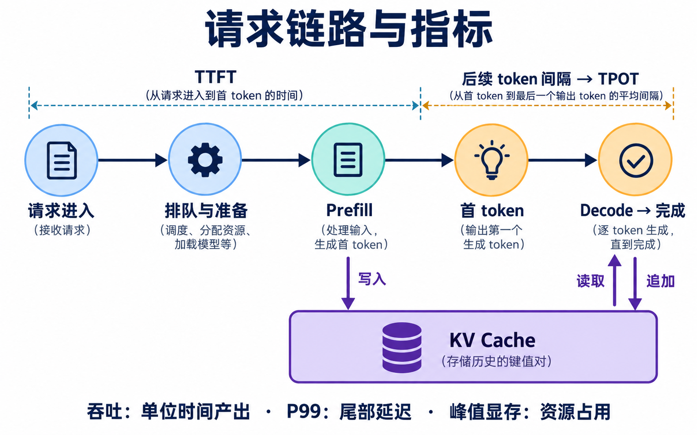
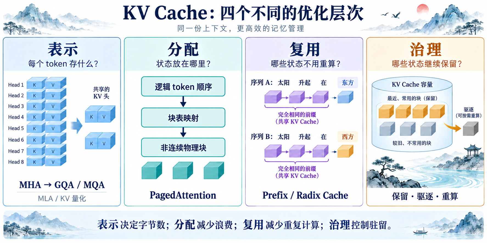
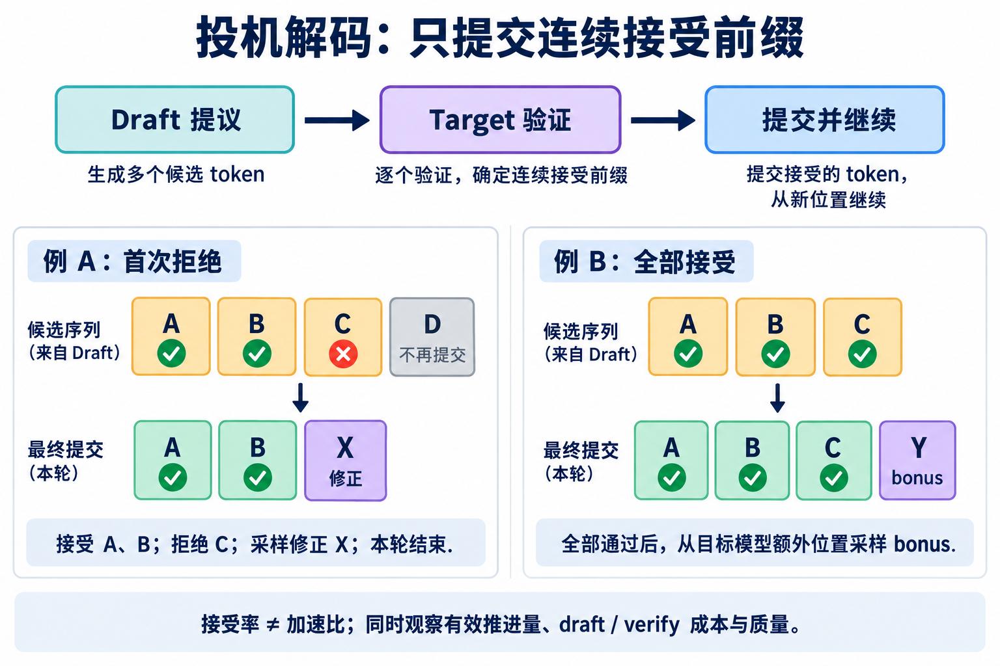
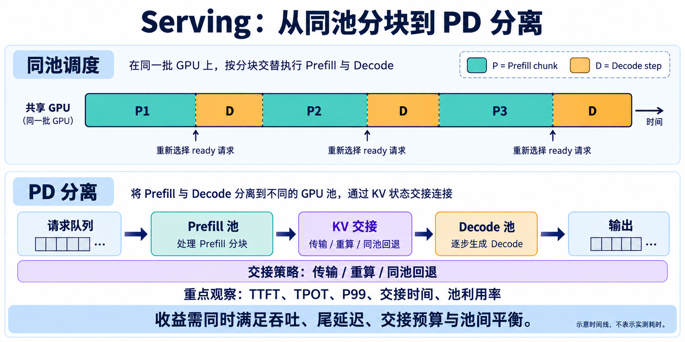

<div align="center">

# LLM Inference & Serving

### 大模型推理优化 · 从一次请求到服务系统

理解 **Prefill → Decode** 的计算路径，掌握 **KV Cache → 量化 → 调度** 的资源取舍，
用 **TTFT · TPOT · 吞吐 · P99** 判断一次优化是否真正有效。

**28 项资料整合 · 4 张机制图解 · 中文系统笔记 · Python 最小自检**

[📓 打开 Jupyter Notebook](LLM_Inference_Serving_Organized_Notes.ipynb)

</div>

---

> **从“这个技术是什么”，走到“我的请求为什么慢，下一步该测什么”。**  
> 这份笔记把分散的推理机制串成一条学习主线：请求经过哪些阶段，状态如何增长，多个请求如何竞争资源，以及怎样建立可信的性能对照。



*先看请求链路，再看优化机制。图中的模型加载对应冷启动；热请求指标需单独计量。*

## 你将学到什么

- **解释性能现象**：区分首 token 慢、后续生成慢、显存不足与排队拥塞。
- **分清优化对象**：GQA 改变状态规模，FlashAttention 改变访存，分页改变分配，前缀缓存改变复用。
- **看懂生成策略**：从 Temperature、Top-K、Top-p，到投机解码的接受、修正与 bonus。
- **理解系统取舍**：量化、连续批处理、Chunked Prefill、PD 分离为什么可能提高吞吐，却伤害质量或尾延迟。
- **设计可比较的实验**：固定 workload，把机制证据、服务指标、失败状态和质量门槛放进同一份判断。

## 学习路线

```text
一次推理请求
    │
    ├── 观察结果：TTFT / TPOT / Throughput / P99 / Peak Memory
    │
    ├── 理解计算：GPU 内存层级 → Attention → FlashAttention
    │
    ├── 理解生成：采样策略 → Draft / Verify → 有效 token 推进
    │
    ├── 管理状态：KV 表示 → 分页 → 前缀复用 → 驱逐与量化
    │
    └── 组织服务：Batch / Queue → Chunked Prefill → PD / 异构路由
                                                        │
                                          固定 workload，验证收益
```

| 模块 | 核心内容 | 读完能回答的问题 |
| :--- | :--- | :--- |
| **01 · 请求与指标** | 时间戳、阶段耗时、服务目标、请求分布 | TTFT 为什么不等于 Prefill 时间？ |
| **02 · GPU 与 Attention** | Roofline、SRAM、张量形状、MHA / GQA / MQA | 到底是装不下、搬得慢，还是算得慢？ |
| **03 · Prefill 优化** | 分块工作集、Online Softmax、SDPA dispatch | 减少中间写回如何影响长输入？ |
| **04 · Decode 策略** | 采样、经典投机、候选预算、质量约束 | 接受率高为什么仍可能不加速？ |
| **05 · KV Cache** | 字节账本、PagedAttention、Radix、LRU、生命周期 | 表示、分配、复用与治理有何区别？ |
| **06 · 量化部署** | INT4 / INT8、W8A16、GPTQ / AWQ、FP8、KV 量化 | 文件变小为什么不代表推理更快？ |
| **07 · Serving 调度** | 请求选择、连续批处理、Chunked Prefill、PD、交接 | 分池为什么可能改善吞吐却恶化 P99？ |
| **08 · 实验闭环** | 综合、投机、缓存与调度四类 Benchmark | 怎样形成可复查的 accept / tune / reject 决策？ |
| **09–10 · 复习与校注** | 诊断路线、复习题、公式和证据边界 | 看到一种现象，下一项最小证据是什么？ |

## 三张图，串起关键机制

### KV Cache：先确认你在优化哪一层



*表示决定每个 token 保存什么，分配决定状态放在哪里，复用减少重复计算，治理控制驻留时间。图中的两组共享 KV 是 GQA 示意；MQA 只有一组。*

<details>
<summary><strong>展开：投机解码——首次拒绝后发生什么？</strong></summary>



只提交连续接受前缀。首次拒绝后采样 correction；全部接受后可追加 bonus。图示的是接受判定顺序，target 概率可集中计算。

</details>

<details>
<summary><strong>展开：Serving——同池分块与 PD 分离如何衔接？</strong></summary>



同池分块增加调度机会；PD 引入资源隔离，也引入状态交接。传输、重算和同池回退是需要比较的不同路径，图中时间段不表示实测比例。

</details>

## 开始阅读

打开 [Jupyter Notebook](LLM_Inference_Serving_Organized_Notes.ipynb) 阅读笔记；需要运行最小自检时，下载文件并在 JupyterLab 或 VS Code 中打开。

Notebook 已内嵌四张图片，单独下载也能查看配图。最小自检只依赖 Python 标准库，检查时间口径、KV 字节、分页边界与前缀上下文反例；阅读无需下载模型或启动 GPU 服务。

**建议顺序：**第一次学习按章节顺序阅读；已有基础时，先看第 09 章诊断表，再回到对应机制与实验章节。

## 关于证据与范围

这里把不同层次的结论分开标注：

**理论账本 / CPU 模拟 → GPU 机制探针 → 真实模型状态 → Backend 服务实验**

笔记覆盖概念、公式、实现边界和实验设计。教学模拟不等于生产实现，局部误差不等于任务质量，历史 smoke 结果也不等于稳定的服务性能结论。**本次整理没有运行 GPU 或 backend benchmark**，文中的历史数字均标明来源性质。

本项目基于 **21 个文件、6 份粘贴附件及 1 段请求链路正文**整理，来源编号与名称保留在笔记末尾。此发布包只包含整理成果，不包含原始资料或原文附录。

---

<div align="center">

**理解机制 → 定位瓶颈 → 固定条件 → 验证收益**

[开始阅读 Notebook →](LLM_Inference_Serving_Organized_Notes.ipynb)

</div>
